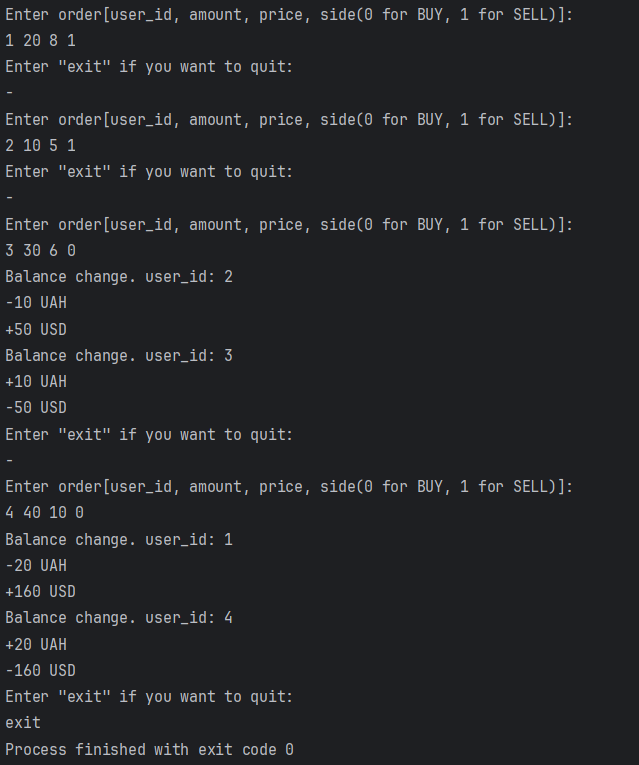

# Orderbook
<h3>Technical task for Distributed Lab</h3>
This project implements a digital order book for trading UAH as the base asset against USD as the quote asset. 
The order book facilitates asset exchange by matching buy and sell orders based on price. 
It maintains two sorted lists: 
Sell Orders: Users selling UAH, sorted from lowest to highest price. 
Buy Orders: Users buying UAH, sorted from highest to lowest price. 
<h3>How to Run</h3>
1. Clone repository to CLion. 
2. Run in IDE [Shift+F10]. 
3. Enter orders until you get bored. 
4. View results. 
   
<h3>Remark</h3>
I used a priority queue that performs the basic push and pop operations with O(log n) efficiency. 
Thanks to this, it determines whether there is a match of orders with O(1) efficiency.
